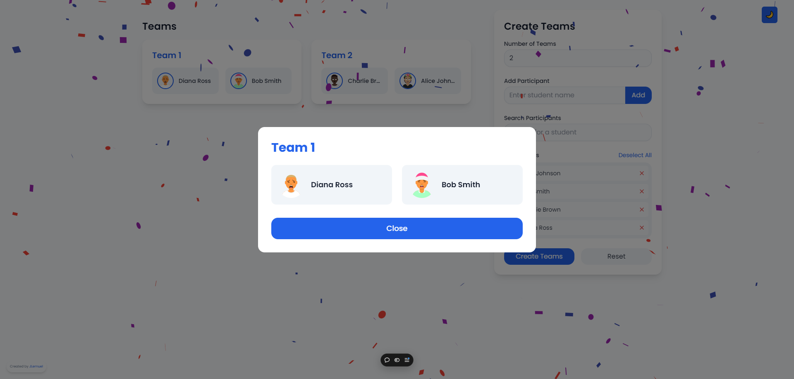

# SquadSync

SquadSync is an intuitive, web-based application designed to streamline the process of creating balanced teams in educational settings. Perfect for teachers, professors, and group facilitators, SquadSync takes the hassle out of organizing students into collaborative groups.



## Features

- **Dynamic Team Formation**: Create teams with a customizable number of groups.
- **Student Management**: Add, remove, and search for students with ease.
- **Visual Student Profiles**: Each student is represented by a unique avatar.
- **Flexible Group Sizing**: Adjust the number of teams to fit your class size.
- **Instant Team Generation**: Generate balanced teams with a single click.
- **Dark Mode Interface**: A sleek, modern design that's easy on the eyes.
- **Celebratory Animations**: Enjoy a burst of confetti when teams are created.

## Tech Stack

- [Next.js 14](https://nextjs.org/) - React framework for production
- [React](https://reactjs.org/) - JavaScript library for building user interfaces
- [Zustand](https://github.com/pmndrs/zustand) - State management
- [TailwindCSS](https://tailwindcss.com/) - Utility-first CSS framework
- [TypeScript](https://www.typescriptlang.org/) - Typed superset of JavaScript

## Project Structure

```
squadsync/
├── app/
│   ├── components/
│   │   ├── GroupList.tsx
│   │   ├── StudentList.tsx
│   │   └── GroupForm.tsx
│   ├── layout.tsx
│   ├── page.tsx
│   └── opengraph-image.png
├── public/
│   └── (static files)
├── store/
│   └── useStore.ts
├── types/
│   └── index.ts
├── README.md
├── next.config.js
├── tailwind.config.js
└── package.json
```

## Getting Started

### Prerequisites

- Node.js (v18 or later recommended for Next.js 14)
- npm or yarn

### Installation

1. Clone the repository:
   ```
   git clone https://github.com/yourusername/squadsync.git
   ```

2. Navigate to the project directory:
   ```
   cd squadsync
   ```

3. Install dependencies:
   ```
   npm install
   # or
   yarn install
   ```

4. Run the development server:
   ```
   npm run dev
   # or
   yarn dev
   ```

5. Open [http://localhost:3000](http://localhost:3000) with your browser to see the result.

## Adding a Screenshot

To add or update the screenshot in this README:

1. Take a screenshot of your SquadSync application.
2. Save the screenshot as `opengraph-image.png` in the `app/` directory.
3. Next.js 14 will automatically optimize this image.
4. Update the image reference in this README if necessary.

## Usage

1. Add students using the "Add Student" input field.
2. Set the desired number of teams.
3. (Optional) Use the search feature to find specific students.
4. Click "Create Teams" to generate balanced groups.
5. Use the "Reset" button to start over.

## Contributing

Contributions are welcome! Please feel free to submit a Pull Request.

1. Fork the project
2. Create your feature branch (`git checkout -b feature/AmazingFeature`)
3. Commit your changes (`git commit -m 'Add some AmazingFeature'`)
4. Push to the branch (`git push origin feature/AmazingFeature`)
5. Open a Pull Request

## License

This project is licensed under the MIT License - see the [LICENSE.md](LICENSE.md) file for details.

## Acknowledgments

- [Avataaars](https://getavataaars.com/) for providing the avatar generation service.
- [react-confetti](https://github.com/alampros/react-confetti) for the celebratory confetti effect.

---

Built with ❤️ by John Lemuel Nicolas
